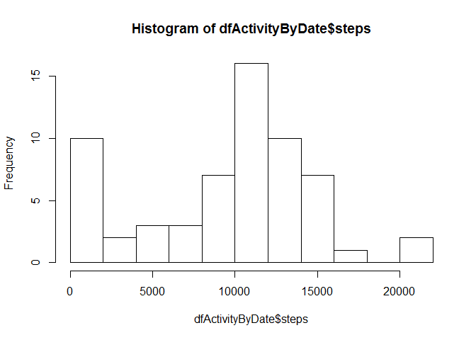
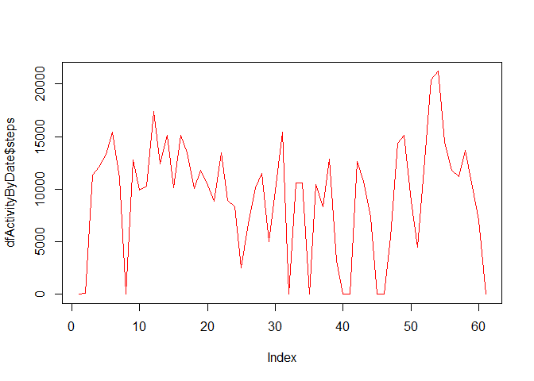
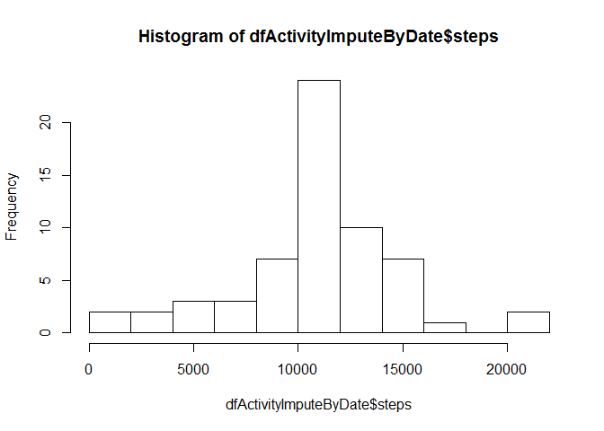
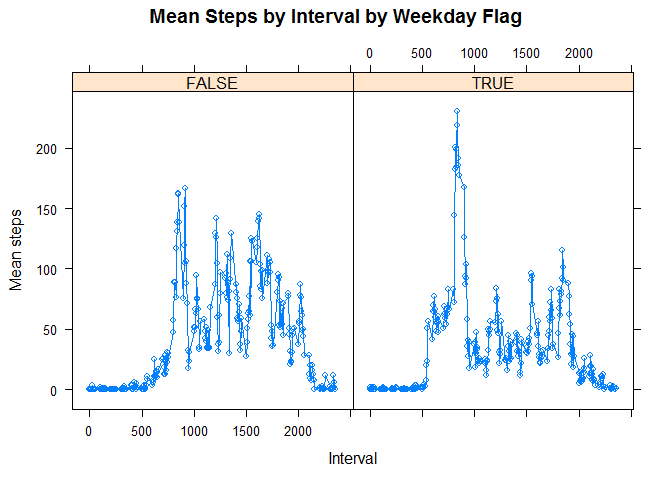

# Reproducible Research: Peer Assessment 1


```r
## Loading and preprocessing the data

#initial setup
setwd("c:/dev/coursera/rr")
library(lattice) 

#1. read in data
dfActivity <- read.csv("activity.csv", colClasses=c("integer", "Date", "integer"))
summary(dfActivity)
```

```
##      steps             date               interval     
##  Min.   :  0.00   Min.   :2012-10-01   Min.   :   0.0  
##  1st Qu.:  0.00   1st Qu.:2012-10-16   1st Qu.: 588.8  
##  Median :  0.00   Median :2012-10-31   Median :1177.5  
##  Mean   : 37.38   Mean   :2012-10-31   Mean   :1177.5  
##  3rd Qu.: 12.00   3rd Qu.:2012-11-15   3rd Qu.:1766.2  
##  Max.   :806.00   Max.   :2012-11-30   Max.   :2355.0  
##  NA's   :2304
```

```r
## What is mean total number of steps taken per day?

#aggregate steps by date
dfActivityByDate <-aggregate(dfActivity$steps, by=list(dfActivity$date), FUN=sum, na.rm=TRUE)
colnames(dfActivityByDate) = c("date", "steps")

#2. histogram steps per day
hist(dfActivityByDate$steps, breaks=10)
```

 

```r
#3. mean, median
summary(dfActivityByDate$steps)
```

```
##    Min. 1st Qu.  Median    Mean 3rd Qu.    Max. 
##       0    6778   10400    9354   12810   21190
```

```r
## What is the average daily activity pattern?

#4. time seres plot
plot(dfActivityByDate$steps, type="l", col="red")
```

 

```r
#now aggregate steps by interval
dfActivityByInterval <-aggregate(dfActivity$steps, by=list(dfActivity$interval), FUN=mean, na.rm=TRUE)
colnames(dfActivityByInterval) = c("interval", "mean_steps")

#5. which row has max mean steps?
dfActivityByInterval[which.max(dfActivityByInterval$steps),]
```

```
## [1] interval   mean_steps
## <0 rows> (or 0-length row.names)
```

```r
## Imputing missing values

#6. impute missing data - insert mean of interval
#first merge 2 tables and sort
dfActivityMerge <- merge(dfActivity,dfActivityByInterval,by="interval")
dfActivityMergeSort <- dfActivityMerge[order(dfActivityMerge$date, dfActivityMerge$interval),]
dfActivityImpute <- dfActivityMergeSort

#and replace NAs with mean of that interval
dfActivityImpute[is.na(dfActivityImpute$steps),"steps"] <- dfActivityImpute[is.na(dfActivityImpute$steps),"mean_steps"]
summary(dfActivityImpute)
```

```
##     interval          steps             date              mean_steps     
##  Min.   :   0.0   Min.   :  0.00   Min.   :2012-10-01   Min.   :  0.000  
##  1st Qu.: 588.8   1st Qu.:  0.00   1st Qu.:2012-10-16   1st Qu.:  2.486  
##  Median :1177.5   Median :  0.00   Median :2012-10-31   Median : 34.113  
##  Mean   :1177.5   Mean   : 37.38   Mean   :2012-10-31   Mean   : 37.383  
##  3rd Qu.:1766.2   3rd Qu.: 27.00   3rd Qu.:2012-11-15   3rd Qu.: 52.835  
##  Max.   :2355.0   Max.   :806.00   Max.   :2012-11-30   Max.   :206.170
```

```r
#7. aggregate again
dfActivityImputeByDate <-aggregate(dfActivityImpute$steps, by=list(dfActivityImpute$date), FUN=sum, na.rm=TRUE)
colnames(dfActivityImputeByDate) = c("date", "steps")

#7. histogram steps per day
hist(dfActivityImputeByDate$steps, breaks=10)
```

 

```r
## Are there differences in activity patterns between weekdays and weekends?
#add weekday factor
dfActivityImpute$weekday <- weekdays(dfActivityImpute$date) %in% c("Monday", "Tuesday", "Wednesday", "Thursday", "Friday")
head(dfActivityImpute)
```

```
##     interval     steps       date mean_steps weekday
## 1          0 1.7169811 2012-10-01  1.7169811    TRUE
## 63         5 0.3396226 2012-10-01  0.3396226    TRUE
## 128       10 0.1320755 2012-10-01  0.1320755    TRUE
## 205       15 0.1509434 2012-10-01  0.1509434    TRUE
## 264       20 0.0754717 2012-10-01  0.0754717    TRUE
## 327       25 2.0943396 2012-10-01  2.0943396    TRUE
```

```r
dfActivityByWeekdayInterval <-aggregate(dfActivityImpute$steps, by=list(dfActivityImpute$weekday, dfActivityImpute$interval), FUN=mean, na.rm=TRUE)
colnames(dfActivityByWeekdayInterval) = c("weekday", "interval", "mean_steps")

#8. panel plot
attach(dfActivityByWeekdayInterval)
xyplot(
  mean_steps~interval|weekday, 
  main="Mean Steps by Interval by Weekday Flag", 
  ylab="Mean steps", xlab="Interval", type='b'
) 
```

 
